EM algorithm for GMM (gaussian mixture model)
=============================================

Tensorflow implementation of [EM-algorithm for GMM](https://en.wikipedia.org/wiki/Mixture_model#Gaussian_mixture_model).

  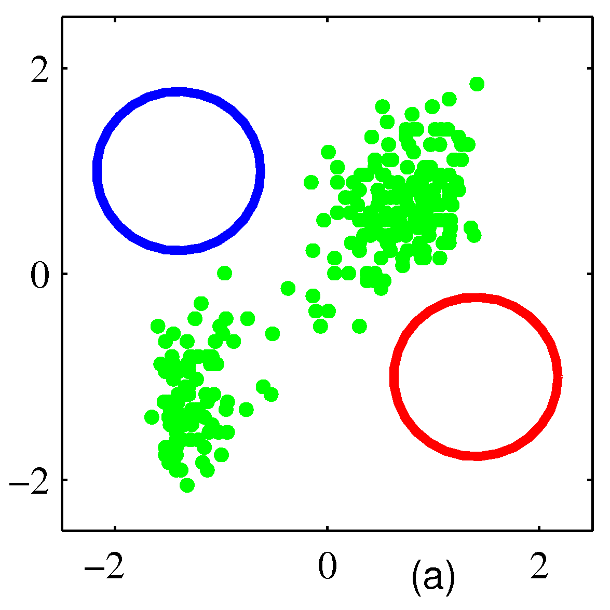
  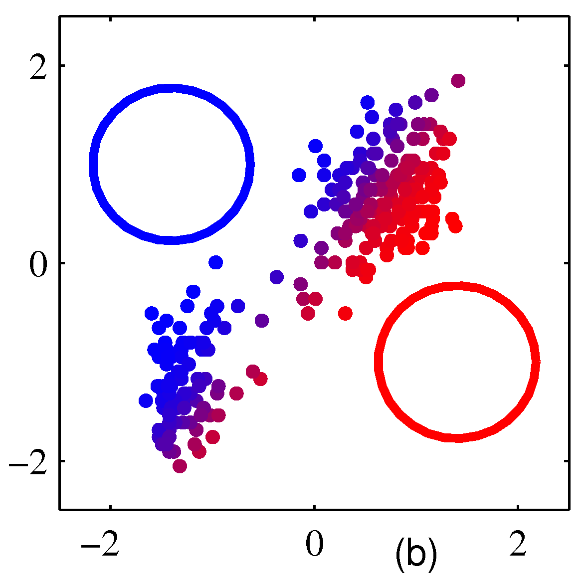
  

  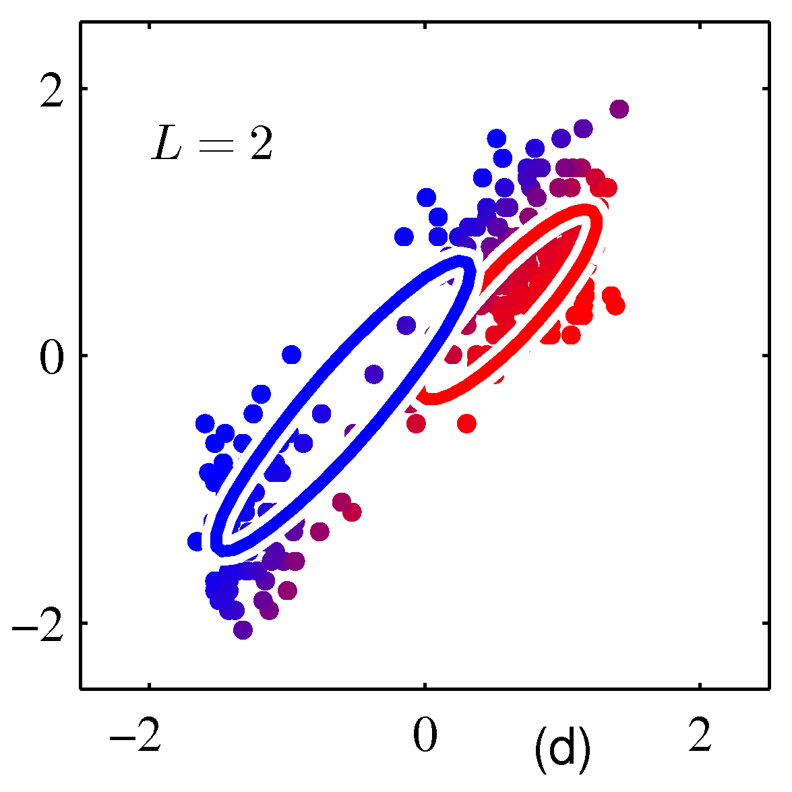
  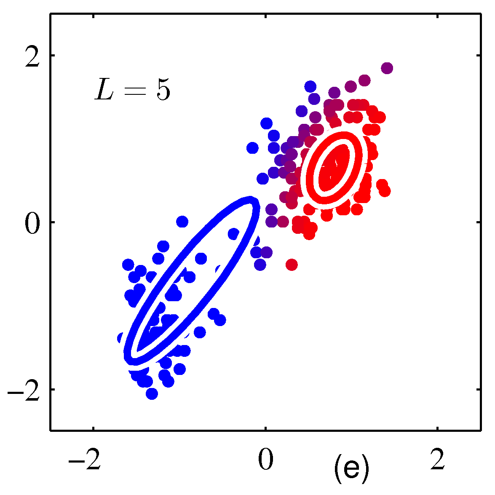
  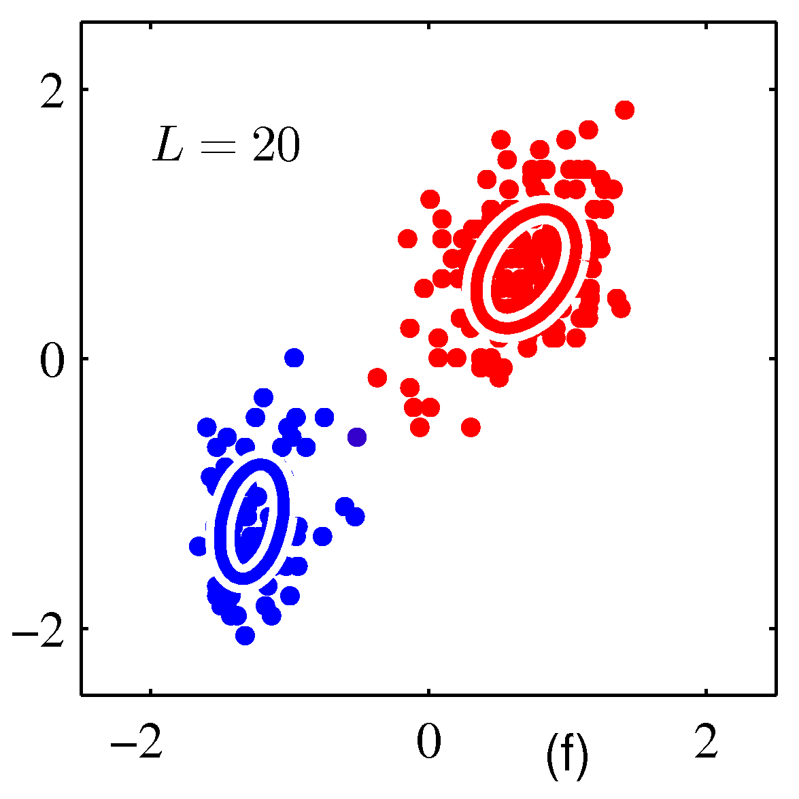

This implementation contains both EM-algorithm and Gradient descent algorithm.

Prerequisites
-------------

- Python 2.7 or Python 3.3+
- [TensorFlow](https://www.tensorflow.org/)

Usage
-----

To use EM-algorithm

    $ python main.py 

To use gradient descent

    $ python main.py --use_GD True
    
Results
-------
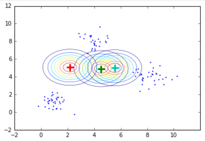
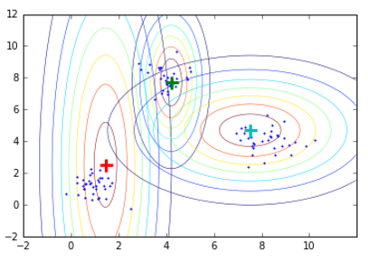
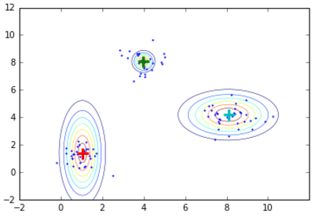
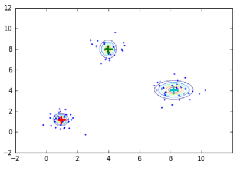
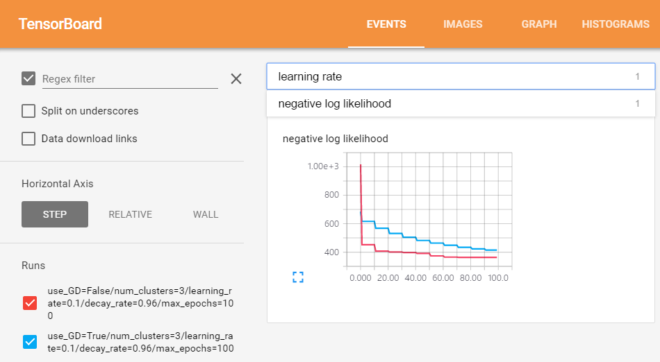
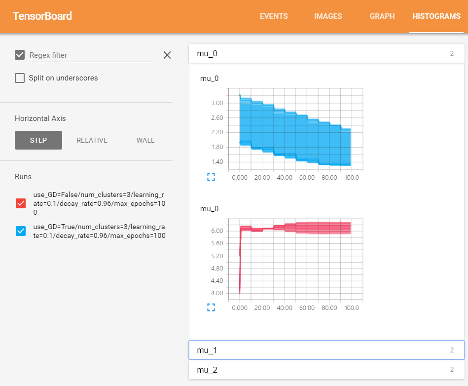

Author
------

Kyowoon Lee / [@leekwoon](http://leekwoon.github.io/)